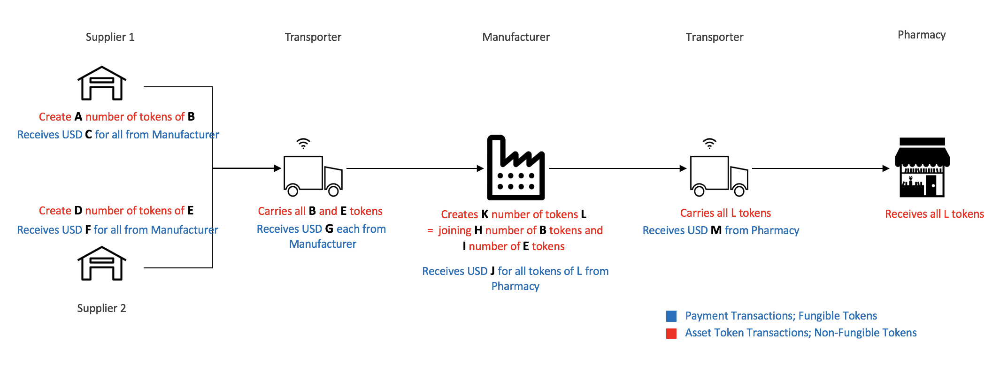

# Are Secure Private Transactions on Public Blockchains Really Possible?  Help Us Find Out.

The world of blockchain technology is really split in two today.  On the one hand, there are big public networks like Ethereum with billions of dollars of investment and millions of users.  On the other hand, there are thousands of private blockchains run by enterprises. Enterprise use of public blockchains is very limited because there is no privacy for business transactions or contracts.  

Our goal at EY is to bridge this gap between public and private blockchains by enabling secure private transactions over public networks using Zero Knowledge Proofs. And we think we have done it.

What we are showing (below) is a supply chain solution based on EY’s Ops Chain platform that is used today by private networks for managing and tracking supply chain operations, but all executed on the public network with zero knowledge proofs. What you see here is a prototype (We call it the Ops Chain Public Edition Prototype) and we’d like your help in finding the holes in our work.  

**Can you tell us who sold what to whom and how much it cost?**

## Aim of the Grand Challenge

There are products travelling through a supply chain process from supplier to manufacturer to pharmacy with the help of a transporter. The aim is to find how many of what products are sent to manufacturer and then how many products of each does the manufacturer assemble to create how many number of final products in order to send to Pharmacy. Also who has paid how much to whom for each of the services provided. The diagram below provides a good illustration of the question.

## What are the ZKP Protocols used and what do they accomplish?

In this work, we use an approach that provides a solution using Zero Knowledge Proofs. Any asset that needs to be tracked is tokenised into a non-fungible token commitment while any payment that needs to be made against this asset is tokenised into a fungible token commitment. Processes are built over the movement of these token commitments using business logic executed through smart contracts. But to maintain privacy for business operations regarding what asset has been transferred between which two parties and how much was paid for it, we use 7 different ZKP protocols.

The zero knowledge proofs for these protocols are generated off chain while the verification of these proofs happen on chain.

The protocols are:

* **Fungible Token Mint** : Creates a fungible token commitment on the blockchain that holds value equivalent to the amount deposited to the `OpsCoinShield.sol` smart contract. The amount deposited can be in the form of any ERC20 token such as Ether. In this example, we use Dollar Tokens created using `OpsCoin.sol` for depositing.
Privacy - Minting is intended to be done from a known address and the value of minted token commitment is known. From the moment the token commitment is minted, nothing about what happened to it after is revealed.

* **Fungible Token Transfer** : Any fungible token commitment can be transferred from an owner to a recipient.
Privacy - Transferring is intended to be done from an anonymous address of the sender, the recipient as well as the value of the token commitment transferred isn't revealed.

* **Fungible Token Burn** : Enables to withdraw the value held in a fungible token commitment back into an ERC20 token such as Ether or Dollar Tokens. In this example, Dollar tokens created using `OpsCoin.sol` will be withdrawn.
Privacy - Burning is intended to be done from a public address and the amount withdrawn is known.

* **Non-Fungible Token Mint** : Creates a Non-Fungible token commitment on the blockchain that represents an asset by holding the asset hash derived from storing the asset's meta data on swarm.
Privacy - Minting is intended to be from a known address, whilst the asset represented by the asset hash in the token commitment isn't revealed.

* **Non-Fungible Token Transfer** : Any Non-Fungible token commitment can be transferred from an owner to a recipient.
Privacy - Transferring is intended to be done from an anonymous address of the sender. The recipient as well as the asset held by the token commitment aren't revealed.

* **Non-Fungible Token Join** : The assets stored on swarm are hierarchical in nature. This protocol enables an asset token commitment to be joined with another asset token commitment. The joined asset along with it's meta data is stored in swarm and a new token commitment is created on the blockchain using the resulting hash that represents this combined asset on the swarm while nullifying the original individual token commitments. Once joined, the new token commitment can be kept by the current owner or transferred to another recipient.
Privacy - The sender, the recipient, the first asset that was joined, the second asset that was joined and the joined asset are not revealed.

* **Non-Fungible Token Split** : This protocol enables an asset token commitment to be split into multiple asset token commitments. These new assets along with their meta data are stored in swarm and new token commitments are created on the blockchain using the resulting hashes that represent these split assets on the swarm while nullifying the original token commitment. Once split, the new token commitments can be kept by the current owner or transferred to another recipient.
Privacy - The sender, the recipient, the original asset split and the split assets are not revealed.

These protocols are used in the movement of all assets and payments on a public blockchain to ensure privacy.

## Contracts

* *Verifier.sol* : This smart contract verifies the zero knowledge proofs for all protocols specified, returning a boolean on success or failure.

* *OpsCoin.sol* : This is an ERC20 token smart contract that mints Public Dollar Tokens used in this example. Private Dollar Tokens can be minted by depositing these Public Dollar Tokens to the `OpsCoinShield.sol` smart contract. Also, Private Dollar tokens can be burnt to withdraw Public Dollar Tokens
using the `OpsCoinShield.sol` contract.

* *OpsCoinShield.sol* : This smart contract acts as a shield by hiding the association of fungible token commitments and their nullifiers. In order to mint, transfer or burn, a transaction is sent to this smart contract which then verifies the proof by calling `Verifier.sol` and adds the relevant token commitments to the token commitments list tree and nullifiers to the nullifiers list array.

* *TokenShield.sol* : This smart contract acts as a shield by hiding the association of non-fungible token commitments and their nullifiers. In order to mint, transfer, join or split, a transaction is sent to this smart contract which then verifies the proof by calling `Verifier.sol` and adds the relevant token commitments to the token commitments list tree, nullifiers to the nullifiers list array and double spend preventifiers to the double spend preventifiers list array. The double spend preventifier does what its named after, ensuring no two token commitments hold the same asset.

## Data Store

**Swarm** - Swarm is used as an off chain distributed storage for asset meta data. The hash returned after storage of an asset is used to represent an asset uniquely and is used in the making of the token commitment that represents this asset.

The swarm public gateway run by Ethereum foundation is used here.
`https://swarm-gateways.net/`

## Information required to get you started on answering the challenge

**List of Ethereum Addresses**

* Coinbase - 0xad70676fdfd0e04d62a3c2d623de04dd8940c642
* Supplier 1 - 0x70623d1c3a316ae22be376374e25476bd308e263
* Supplier 2 - 0x5292606982b9f0db32c56686741f76d133d4c924
* Transporter - 0x6b9e39a04251070a8c5db2ffc8a0ba7972a41478
* Manufacturer - 0x8ae3eff37db50fac1da0d79965154d9cb7523eeb
* Pharmacy - 0xf9ff784b87688e4c32c588f882caf13c6167d70f

**List of Contract Addresses**

* OpsCoin:	0x09b2d8b8741538abf56f47be76e37aed31f00e0d
* OpsCoinShield:	0xe8d9f21b6b351c6bf993b1105497fe42d30df8bf
* TokenShield:	0xeb7160d9fba402219ea868bc311e7d98688d3180
* FT Mint & Burn Verifier: 0x6b98f17897a5086ff3e7357290b36022798d8850
* FT Transfer Verifier: 0xcb4ccc716abe1b5be15870e2bfa12bf5f0b501e6
* NFT Mint Verifier: 0xc5daef66b7752d9c5920c15e9e0145aa839843f3
* NFT Transfer Verifier: 0x8d993aaf8e92c2027a5358b9914392050b03356d
* NFT Join Verifier:	0xf8cb6400dcf523bf6397a79bccd35a6af1a88edd
* NFT Split Verifier:	0xb065dcb7651b448e042a0acc729ae64d2ea3ba51

**List of Anonymous Ethereum Addresses of the above players**

* 0x5a812eb611c72c9b94fbb6876b5f49bcc6e41945
* 0xb61499e29eb7947c59ed82cf9c360d01dd9e5e0c
* 0xa9f91a59b1b5d76334de878dd5dc7627ee748e35
* 0x81caa8ddc289fb7310d2ce1c5e8231f1d7ee9754
* 0x04734be5baa73c907527f03b0a938587f2d3ce61
* 0xc767957dccc903e9969d9bd00c429547de752798
* 0x2250ddc2609d2dcc525a8cdbf8ef20da0b9e408a
* 0x056bd6e88c761faa26cc927ef3fcd907dea77d3b
* 0x9f4abe21c039737a92c4c93715578a4bd344d4ab
* 0x700ec2a9d659a7af8dd9e4c583d782f308878624
* 0x5aba0f87d89f5b96eeb0c16233c357231ebb909b
* 0x643e47ba204d3b4b98e8c2210c104240d37ea7aa
* 0x5e84ed0071e5df742a8052411d5bd292f9294cff
* 0x16a0dcfaf9a495f60afa5aaa298af662f4b97e98

**Other relevant information**
* First Block:	6477282
* Last Block:	6485984

* First Tx Hash:	0x5e608f6caca686b3a3e7a901efdfcc94bc9a593891d7b8f910273ff56f9f1822
* Last Tx Hash	0x83007c1a4af2ef1487fe020c1ea2f343c552d187a2f6aac52720abbefe5470e7

### Limitations
* The usage of the terms 'fungible' and 'non-fungible' for token commitments means that the token commitments hold fungible or non-fungible assets by nature. It does not imply that the token commitments are tokens themselves that are ERC20 or ERC720 standard compatible.
* It can be noted that inputs to proof verification are of 64 bits in length. Generally, this length is not secure against brute force attacks. In the later iterations of this work, these will be changed to 256 bits.
* Various performance improvements can be made to make the contracts more cost efficient such as using trees in place of arrays to hold nullifiers or double spend preventifiers. Upcoming iterations of the work will address this.
* The maximum number of token commitments that the merkle tree currently holds is 256. The next iteration will increment this for practical use.
* The usage of the term 'public dollar tokens' implies that OpsCoin is a stable coin that represents a dollar.
* Some of the work for fungible token here is inspired by ZCash

© 2018 EYGS LLP and/or other members of the global Ernst & Young/EY network; pat. pending.
